# Tugas Praktikum 1 Semester 2 [Pertemuan ke-6]

## Soal Praktikum

**1. Buat sebuah database dengan nama latihan2!**

```
CREATE DATABASE latihan2;
```

Setelah membuat database dengan nama latihan2, masuk ke database latihan2 menggunakan command berikut ini:

```
USE latihan2;
```

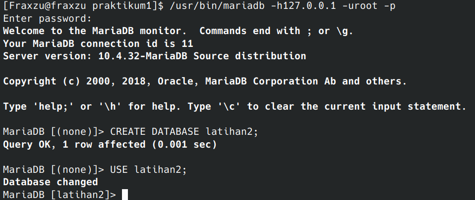

**2. Buat sebuah tabel dengan nama biodata (nama, alamat) didalam database latihan2!**

gunakan perintah ini untuk membuat tabel:

```
CREATE TABLE biodata (
nama TEXT,
alamat TEXT
);
```

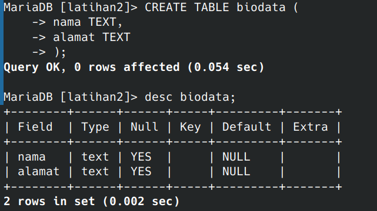

**3. Tambahkan sebuah kolom keterangan (varchar 15), sebagai kolom terakhir!**

kita bisa menulis perintah ini untuk menambahkan kolom **keterangan** sebagai kolom terakhir:

```
ALTER TABLE biodata ADD COLUMN keterangan VARCHAR (15);
```

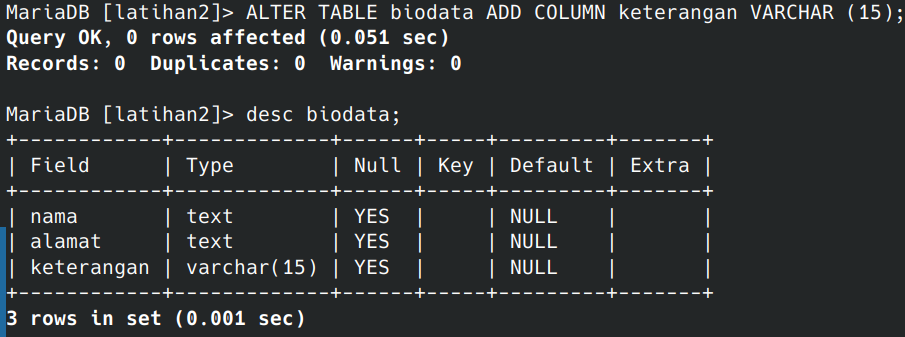

**4. Tambahkan kolom id (int 11) di awal (sebagai kolom pertama)!**

Gunakan perintah ini untuk menambahkan kolom **id** sebagai kolom pertama / awal:

```
ALTER TABLE biodata ADD COLUMN id int FIRST;
```

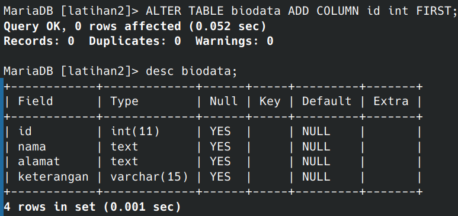

**5. Sisipkan sebuah kolom dengan nama phone (varchar 15) setelah kolom alamat!**

gunakan perintah ini untuk menyisipkan kolom dengan nama **phone** setelah kolom **alamat**:

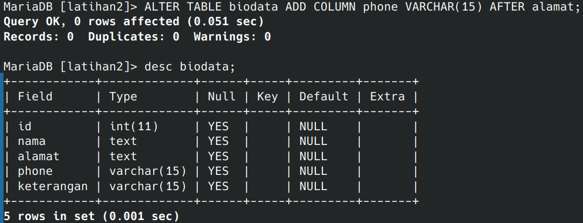

**6. Ubah tipe data kolom id menjadi char(11)!**

Tulis perintah ini untuk mengubah tipe data kolom **id** menjadi char(11):

```
ALTER TABLE biodata MODIFY COLUMN id CHAR(11);
```

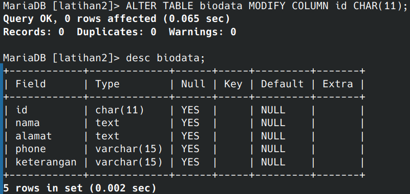

**7. Ubah nama kolom phone menjadi hp (varchar 20)!**

Tulis perintah ini untuk mengubah nama kolom **phone** menjadi **hp** (varchar 20):

```
ALTER TABLE biodata CHANGE COLUMN phone hp VARCHAR(20);
```

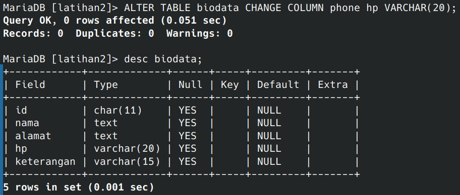

**8. Tambahkan kolom email setelah kolom hp**

Gunakan perintah ini untuk menambahkan kolom **email** setelah kolom **hp**:

```
ALTER TABLE biodata ADD COLUMN email TEXT AFTER hp;
```

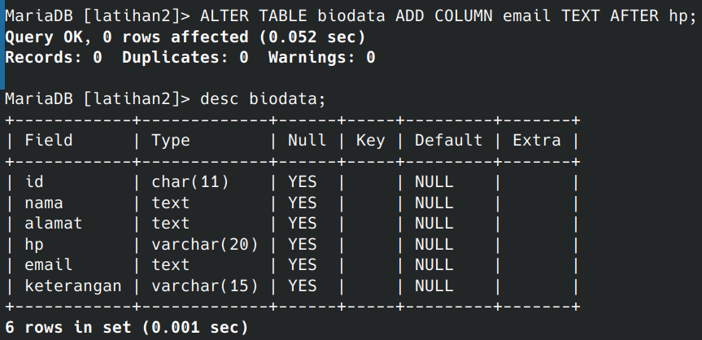

**9. Hapus kolom keterangan dari tabel!**

Gunakan perintah ini untuk menghapus kolom **keterangan** dari tabel:

```
ALTER TABLE biodata DROP COLUMN keterangan;
```

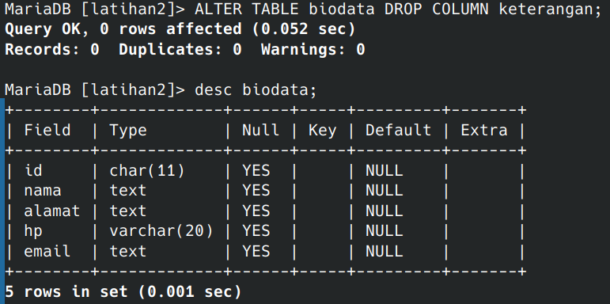

**10. Ganti nama tabel menjadi data_mahasiswa!**

Tulis perintah ini untuk mengganti nama tabel menjadi **data_mahasiswa**:

```
ALTER TABLE biodata RENAME data_mahasiswa;
```

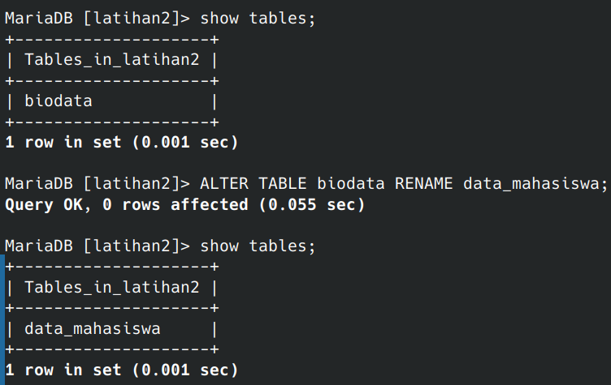

**11. Ganti nama field id menjadi nim!**

Tulis perintah ini untuk mengganti nama **field** id menjadi **nim**:

```
ALTER TABLE data_mahasiswa CHANGE id nim CHAR(11);
```

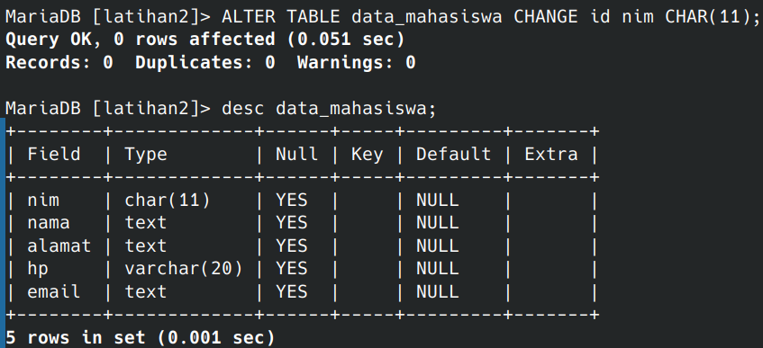

**12. Jadikan nim sebagai PRIMARY KEY!**

Gunakan perintah ini untuk menjadikan **nim** sebagai **PRIMARY KEY**:

```
ALTER TABLE data_mahasiswa ADD PRIMARY KEY(nim);
```

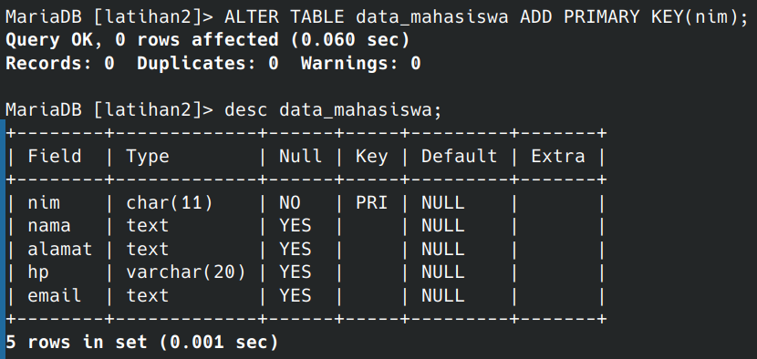

**13. Jadikan kolom email sebagai UNIQUE KEY**

Tulis perintah ini untuk menjadikan kolom email sebagai **UNIQUE KEY**:

```
ALTER TABLE data_mahasiswa ADD UNIQUE KEY(email);
```

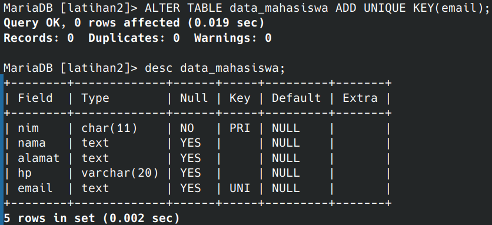

## Evaluasi dan Pertanyaan

- Apa maksud dari int (11)?

   INT(11) Adalah Nama Tipe Datanya Yaitu ```Integer``` dan Memiliki Panjang 11 Karakter.

- Ketika kita melihat struktur tabel dengan perintah desc, ada kolom **Null** yang berisi **Yes** dan **No**. Apa maksudnya ?

   Kolom "Null" dengan nilai "Yes" berarti dapat memiliki nilai NULL, sementara "No" berarti wajib memiliki nilai.